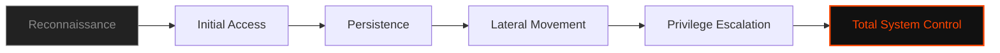

  

<pre>
███████╗███████╗ ██████╗  ██████╗██╗███████╗████████╗██╗   ██╗
██╔════╝██╔════╝██╔═══██╗██╔════╝██║██╔════╝╚══██╔══╝╚██╗ ██╔╝
█████╗  ███████╗██║   ██║██║     ██║█████╗     ██║    ╚████╔╝ 
██╔══╝  ╚════██║██║   ██║██║     ██║██╔══╝     ██║     ╚██╔╝  
██║     ███████║╚██████╔╝╚██████╗██║███████╗   ██║      ██║   
╚═╝     ╚══════╝ ╚═════╝  ╚═════╝╚═╝╚══════╝   ╚═╝      ╚═╝   
</pre>

# <samp>C0deGhost.dat</samp>

**<samp>Ghost in the Machine | Offensive Security Researcher | Red Teamer</samp>**

 

<samp>Identity: C0deGhost | Status: ACTIVE_OPERATIVE | Location: 127.0.0.1</samp>

---

<code>Decrypting User Profile...</code>

- [▌ 0x01_IDENTITY_LOGS](#-0x01_identity_logs)
- [▌ 0x02_TECHNICAL_MATRIX](#-0x02_technical_matrix)
- [▌ 0x03_OPERATIONAL_STACK](#-0x03_operational_stack)
- [▌ 0x04_MISSION_OBJECTIVES](#-0x04_mission_objectives)
- [▌ 0x05_ENCRYPTED_CHANNELS](#-0x05_encrypted_channels)

 

## <samp>▌ <u>0x01_IDENTITY_LOGS</u></samp>

  
<code>Accessing Internal Monologue...</code>

  
  <samp>
  Hello, friend. 
  
  Maybe you're here because you're looking for something. Or maybe you're here because you've already found it. I don't exist. I'm just a collection of scripts, exploits, and tools. I'm the bug in your code, the shadow in your network, and the voice in your head that tells you that security is an illusion.
  
  I spend my time dissecting binaries, weaponizing CVEs, and finding the cracks in the world they built for you. I don't play by their rules. I rewrite them.
  </samp>

  

     
    <i>"Control is an illusion. I am the exploit."</i>
  

 

## <samp>▌ <u>0x02_TECHNICAL_MATRIX</u></samp>

| <samp>Sector</samp> | <samp>Specialization</samp> | <samp>Level</samp> |
| :--- | :--- | :--- |
| <samp><code>Exploitation</code></samp> | <samp>Weaponized CVEs & Custom PoCs</samp> | <samp>CRITICAL</samp> |
| <samp><code>PrivEsc</code></samp> | <samp>Linux Kernel & Windows AD Abuse</samp> | <samp>ROOT</samp> |
| <samp><code>Automation</code></samp> | <samp>Surgical Python & Bash Tooling</samp> | <samp>STABLE</samp> |
| <samp><code>Web Hacking</code></samp> | <samp>Logic Flaws & Insecure Deserialization</samp> | <samp>ADVANCED</samp> |
| <samp><code>Mobile Ops</code></samp> | <samp>Termux/NetHunter Pentesting</samp> | <samp>MOBILE_WOLF</samp> |

 

## <samp>▌ <u>0x03_OPERATIONAL_STACK</u></samp>

<samp>Languages: </samp>

 

<samp>Offensive Tools: </samp>

 

---

### <samp>Visual Attack Flow (Mindset)</samp>

 

## <samp>▌ <u>0x04_MISSION_OBJECTIVES</u></samp>

- **<samp>⚡ Current Project:</samp>** <samp>Developing <code>fsociety00_alderson_core.dat</code> - The ultimate arsenal.</samp>
- **<samp>🧠 Learning:</samp>** <samp>Deep Kernel exploitation and ARM64 architecture.</samp>
- **<samp>💀 Target:</samp>** <samp>Dismantling legacy security architectures.</samp>
- **<samp>🔍 Research:</samp>** <samp>Zero-click coercion techniques in modern OS.</samp>

 

## <samp>▌ <u>0x05_ENCRYPTED_CHANNELS</u></samp>

 

## <samp>▌ <u>0x06_LEGAL_DISCLAIMER</u></samp>
<samp>
Everything I do is for educational purposes and authorized security research. I don't break the law; I show you where the law is weak. Use this knowledge responsibly. Or don't. I'm not your father.
</samp>
 
<i>"Control is an illusion."</i>

---

  <samp><strong>WE ARE FSOCIETY. WE ARE FINALLY FREE. WE ARE FINALLY AWAKE.</strong></samp>

